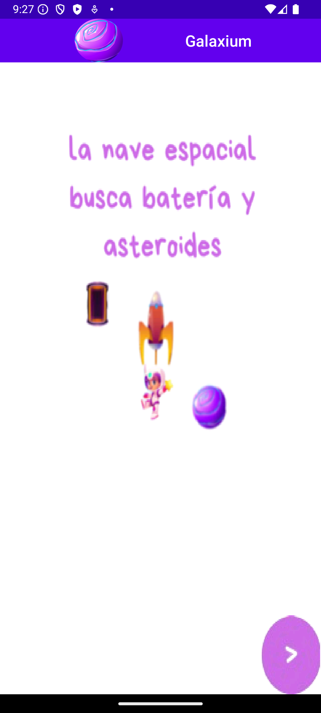

# Galaxium

## Descripción

**GALAXIUM** es un juego de exploración espacial en el que el jugador controla una nave espacial en un mundo lleno de asteroides, baterías y otros desafíos. El objetivo es navegar por el espacio, evitando los asteroides y recolectando baterías para mejorar la nave. Si la nave toca los bordes del mundo o un asteroide, el juego termina. Si recolecta una batería, gana puntos y aumenta su tamaño. Es un proyecto realizado con Android Studio para la asignatura de Laboratorios de Dispositivos Móviles.

### Características principales:

- **Temática Espacial**: El jugador controla una nave espacial y debe navegar por un entorno lleno de asteroides, baterías y otros elementos.
- **Colisiones**: Las colisiones con asteroides restan puntos, mientras que las baterías suman puntos y extienden el tamaño de la nave.
- **Mecánica de juego**: El jugador debe manejar con precisión la nave para evitar los asteroides y recoger las baterías en un mundo limitado.
- **Pantallas**: El juego incluye varias pantallas, como la pantalla principal, las pantallas de ayuda, la pantalla de puntuaciones y las pantallas durante el juego y al final del mismo.

## Instalación

Clona este repositorio:
```bash
   git clone git@github.com:loreeue/Galaxium-AppMobile.git
```


## Estructura del Proyecto

El proyecto está compuesto por las siguientes pantallas y funcionalidades:

- **Pantalla Principal**: Vista inicial con las opciones para comenzar el juego, acceder a la ayuda o ver las puntuaciones.
- **Pantalla Preparado**: Pantalla de preparación antes de iniciar el juego.
- **Pantalla de Juego**: Interfaz principal donde el jugador controla la nave y debe evitar obstáculos y recoger baterías.
- **Pantalla Fin de Juego**: Pantalla que aparece cuando el juego termina.
- **Pantalla Pausa**: Opción para pausar el juego.
- **Pantalla de Puntuaciones**: Muestra las mejores puntuaciones alcanzadas.
- **Pantallas de Ayuda**: Instrucciones para el jugador sobre cómo jugar.


## Imágenes


*Icono App*


*Pantalla Principal*


*Pantalla Preparado*


*Pantalla Juego*


*Pantalla Fin de Juego*



*Pantalla Ayuda 1*


*Pantalla Ayuda 2*


*Pantalla Ayuda 3*


*Pantalla Ayuda 4*
